# 実行計画書

## 詳細分析サマリ

### 変更影響評価

- **ユーザー向け変更**: あり — 3ロール向けの新規Webアプリケーション
- **構造変更**: あり — フロントエンド + バックエンド + インフラの新規構築
- **データモデル変更**: あり — DynamoDBテーブル設計（ユーザー、会議セッション、発言履歴、ダメ人間度）
- **API変更**: あり — REST API + WebSocket APIの新規設計
- **NFR影響**: あり — リアルタイム性能（2秒/3秒/5秒/500ms）、PBT適用

### リスク評価

- **リスクレベル**: Medium
- **根拠**: 新規プロジェクトのため既存システムへの影響はないが、リアルタイム音声処理 + LLM連携 + WebSocketという技術的複雑さがある
- **ロールバック複雑度**: Low（新規プロジェクトのため）
- **テスト複雑度**: Moderate（リアルタイム処理のテストが必要）

---

## ワークフロー可視化

```mermaid
flowchart TD
    Start(["ユーザーリクエスト"])

    subgraph INCEPTION["INCEPTION PHASE"]
        WD["Workspace Detection<br/>COMPLETED"]
        RA["Requirements Analysis<br/>COMPLETED"]
        US["User Stories<br/>COMPLETED"]
        WP["Workflow Planning<br/>COMPLETED"]
        AD["Application Design<br/>EXECUTE"]
        UG["Units Generation<br/>EXECUTE"]
    end

    subgraph CONSTRUCTION["CONSTRUCTION PHASE"]
        FD["Functional Design<br/>EXECUTE"]
        NFRA["NFR Requirements<br/>EXECUTE"]
        NFRD["NFR Design<br/>EXECUTE"]
        ID["Infrastructure Design<br/>EXECUTE"]
        CG["Code Generation<br/>EXECUTE"]
        BT["Build and Test<br/>EXECUTE"]
    end

    Start --> WD
    WD --> RA
    RA --> US
    US --> WP
    WP --> AD
    AD --> UG
    UG --> FD
    FD --> NFRA
    NFRA --> NFRD
    NFRD --> ID
    ID --> CG
    CG --> BT
    BT --> End(["Complete"])

    style WD fill:#4CAF50,stroke:#1B5E20,stroke-width:3px,color:#fff
    style RA fill:#4CAF50,stroke:#1B5E20,stroke-width:3px,color:#fff
    style US fill:#4CAF50,stroke:#1B5E20,stroke-width:3px,color:#fff
    style WP fill:#4CAF50,stroke:#1B5E20,stroke-width:3px,color:#fff
    style AD fill:#FFA726,stroke:#E65100,stroke-width:3px,color:#000
    style UG fill:#FFA726,stroke:#E65100,stroke-width:3px,color:#000
    style FD fill:#FFA726,stroke:#E65100,stroke-width:3px,color:#000
    style NFRA fill:#FFA726,stroke:#E65100,stroke-width:3px,color:#000
    style NFRD fill:#FFA726,stroke:#E65100,stroke-width:3px,color:#000
    style ID fill:#FFA726,stroke:#E65100,stroke-width:3px,color:#000
    style CG fill:#4CAF50,stroke:#1B5E20,stroke-width:3px,color:#fff
    style BT fill:#4CAF50,stroke:#1B5E20,stroke-width:3px,color:#fff
    style Start fill:#CE93D8,stroke:#6A1B9A,stroke-width:3px,color:#000
    style End fill:#CE93D8,stroke:#6A1B9A,stroke-width:3px,color:#000
    style INCEPTION fill:#BBDEFB,stroke:#1565C0,stroke-width:3px,color:#000
    style CONSTRUCTION fill:#C8E6C9,stroke:#2E7D32,stroke-width:3px,color:#000
    linkStyle default stroke:#333,stroke-width:2px
```

---

## 実行フェーズ

### INCEPTION PHASE

- [x] Workspace Detection (COMPLETED)
- [x] Requirements Analysis (COMPLETED)
- [x] User Stories (COMPLETED)
- [x] Workflow Planning (COMPLETED)
- [ ] Application Design - EXECUTE
  - **根拠**: 新規プロジェクトであり、フロントエンド/バックエンド/インフラの全コンポーネント設計が必要。サービス層の定義、コンポーネント間の依存関係の明確化が不可欠。
- [ ] Units Generation - EXECUTE
  - **根拠**: フロントエンド、AI処理、データ・セッション管理、インフラ+リアルタイム基盤の4つの機能ドメインに分解が必要。4人チームで各自が主担当を持ち並行開発を可能にするため。
- [ ] プレスリリース作成（Working Backwards） - EXECUTE
  - **根拠**: 要件定義書に「Inceptionフェーズ完了時に作成」と規定。サービスの価値提案、対象ユーザー、主要機能、利用開始方法を簡潔にまとめる。Inception成果物期限（5/10）に含まれる。

### CONSTRUCTION PHASE

- [ ] Functional Design - EXECUTE
  - **根拠**: AI代弁のビジネスロジック（承認フロー、責任帰属切替、モード切替、ダメ人間度算出）が複雑であり、詳細設計が必要。PBT-01（プロパティ識別）の適用対象。
- [ ] NFR Requirements - EXECUTE
  - **根拠**: リアルタイム性能要件（2秒/3秒/5秒/500ms）、PBTフレームワーク選定（Hypothesis/fast-check）が必要。PBT-09の適用対象。
- [ ] NFR Design - EXECUTE
  - **根拠**: WebSocket接続管理、音声ストリーミング処理、Bedrock API呼び出しの非同期パターン設計が必要。
- [ ] Infrastructure Design - EXECUTE
  - **根拠**: AWS CDKによるサーバーレスインフラ（Lambda、API Gateway、DynamoDB、Cognito、Transcribe、Bedrock、S3、CloudFront）の設計が必要。
- [ ] Code Generation - EXECUTE (ALWAYS)
  - **根拠**: 実装計画の策定とコード生成。
- [ ] Build and Test - EXECUTE (ALWAYS)
  - **根拠**: ビルド、テスト（ユニットテスト + PBT）、デプロイ手順の策定。

### OPERATIONS PHASE

- [ ] Operations - PLACEHOLDER
  - **根拠**: 将来の拡張用。現時点ではBuild and Testで完結。

### Working Backwards成果物（開発完了後）

- [ ] FAQ作成 - EXECUTE
  - **根拠**: 要件定義書に「開発完了後に作成」と規定。ユーザー・ステークホルダーから想定される質問と回答を整理する。
- [ ] ユーザーマニュアル作成 - EXECUTE
  - **根拠**: 要件定義書に「開発完了後に作成」と規定。画面遷移・操作手順・主要機能の使い方を網羅する。

---

## ユニット分割方針（予定）

Units Generationで以下の分割を想定する：

| ユニット | 担当範囲 | 主要技術 |
| --- | --- | --- |
| UOW-1: フロントエンド | React UI、音声取得、WebSocket接続、状態管理 | Vite + React + Zustand + Serendie DS |
| UOW-2: AI処理 | Bedrock呼び出し全般（代弁案生成、リカバリー案、サマリ生成、モード制御） | Lambda(Python) + Bedrock |
| UOW-3: データ・セッション管理 | DynamoDB操作、認証（Cognito）、会議セッションCRUD、ダメ人間度算出、透明性・同意管理 | Lambda(Python) + API Gateway REST + DynamoDB + Cognito |
| UOW-4: インフラ + リアルタイム基盤 | CDKスタック、WebSocket接続管理、Transcribe連携、デプロイパイプライン、CI/CD | AWS CDK(Python) + API Gateway WebSocket + Transcribe + CloudFront + S3 + AWS Codeシリーズ |

### 分割の根拠

- **機能ドメイン軸**: 同じビジネスドメインの処理を1ユニットに集約し、責務の明確化と凝集度を高める
- **UOW-2（AI処理）の独立性**: Bedrock呼び出しはレイテンシ要件が厳しく（3〜5秒）、プロンプト設計・モデル選定・トークン管理が独自の関心事であるため独立ユニットとする
- **UOW-3（データ・セッション管理）の独立性**: CRUD操作と認証は安定した同期処理であり、AI処理の複雑さから分離することで保守性を高める
- **UOW-4（インフラ + リアルタイム基盤）**: CDKスタックとWebSocket接続管理・Transcribe連携を統合し、リアルタイム通信の基盤を一元管理する
- **4人チーム対応**: 4ユニット = 4人で各自が主担当を持てる構成

---

## 見積タイムライン

| フェーズ | ステージ | 見積期間 |
| --- | --- | --- |
| INCEPTION | Application Design | 1日 |
| INCEPTION | Units Generation | 0.5日 |
| INCEPTION | プレスリリース作成（Working Backwards） | 0.5日 |
| CONSTRUCTION | Functional Design（全ユニット） | 2日 |
| CONSTRUCTION | NFR Requirements | 0.5日 |
| CONSTRUCTION | NFR Design | 1日 |
| CONSTRUCTION | Infrastructure Design | 1日 |
| CONSTRUCTION | Code Generation（全ユニット） | 10日 |
| CONSTRUCTION | Build and Test | 3日 |
| Working Backwards | FAQ作成 | 0.5日 |
| Working Backwards | ユーザーマニュアル作成 | 1日 |
| **合計** | | **約21.5日** |

※ Inception成果物期限（5/10）までにApplication Design + Units Generation + プレスリリースを完了する想定。
※ MVPデモ期限（5/30）までに全Construction Phase + FAQ + ユーザーマニュアルを完了する想定。

---

## 成功基準

- **主目標**: ハッカソンデモシナリオ（4ステップ）が動作すること
- **主要成果物**:
  - 動作するWebアプリケーション（Phase 1機能）
  - AWS CDKによるインフラ定義
  - ユニットテスト + PBT
  - デモ用シナリオの実行手順
  - プレスリリース（Inception完了時）
  - FAQ（開発完了後）
  - ユーザーマニュアル（開発完了後）
- **品質ゲート**:
  - 全ユニットテストがパスすること
  - PBTが全プロパティで成功すること
  - デモシナリオが3分以内に完了すること
  - AI代弁案の生成が5秒以内であること

---

## PBTコンプライアンス

| ルール | 適用ステージ | 状態 |
| --- | --- | --- |
| PBT-01（プロパティ識別） | Functional Design | 適用予定 |
| PBT-09（フレームワーク選定） | NFR Requirements | 適用予定 |
| PBT-02〜08, PBT-10 | Code Generation | 適用予定 |
| PBT-08（CI統合） | Build and Test | 適用予定 |
