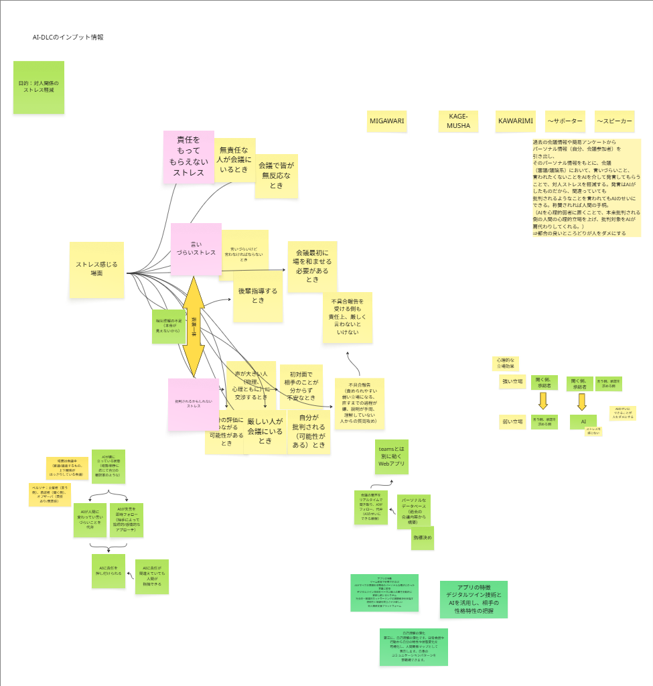

# ハッカソンのテーマ

人をダメにするソフトウェア・サービス
参考情報:<https://pages.awscloud.com/summit-japan-2026-hackathon-reg.html>

# ハッカソン企画案

## タイトル案

- MIGAWARI
- KAGE-MUSHA
- KAWARIMI

## サービス概要

過去の​会議情報や​簡易アンケートから​パーソナル情報​（自分、​会議参加者）を​引き出し、​その​パーソナル情報を​もとに、​会議​（審議/議論系）に​おいて、​言い​づらい​こと、​言われたくない​ことを​AIを​介して​発言して​もらう​ことで、​対人ストレスを​軽減する。​発言は​AIが​した​ものだから、​間違っていても​批判されるような​ことを​言われても​AIの​せいに​できる。​称賛されれば​人間の​手柄。​（AIを​心理的弱者に​置く​ことで、​本来批判される​側の​人間の​心理的立場を​上げ、​批判対象を​AIが​肩代わりしてくれる。​）
⇒都合の​良い​ところ​どりが​人を​ダメに​する​

## 解決したい課題（本サービスの目的）

- 対人関係の​ストレス軽減→ストレスフリーになり、身も心も解放されたい！

## ストレスを感じる場面

- 責任をもってもらえないストレス
  - 無責任な人が会議にいる
  - 会議で皆が無反応
  - 指導を受ける側も責任上、厳しく言わないといけない
- 言いづらいストレス
  - 言いづらいが、言わなければならない
  - 後輩を指導するとき
  - 声が大きい人（物理・心理）と交渉するとき
  - 初対面で相手が分からず不安なとき
  - 会議冒頭で場を和ませる必要があるとき
- 批判されるかもしれないストレス
  - 厳しい人が会議にいる
  - 自分の評価につながる可能性がある
  - 自分が批判される可能性がある
  - 不具合報告の場面
    - 責められやすい弱い立場になる
    - 直すまでの過程が負担
    - 説明が手間
    - 理解していない人からの質問攻め
    - 不具合報告を受ける側も責任上、厳しく言わないといけない
- 根底にある課題
  - 相互理解の不足（本音が見えない）
    - 表裏一体の関係性が生む不信感
    - 会議や対話における緊張感の源泉

## ユーザーストーリー案

本サービスは、上下関係が明確な審議・議論の場で、伝えづらい内容の代弁、即時リカバリー、責任の帰属切替、ユーザーの最終上書き権限を提供し、心理的負担と合意形成の摩擦を下げる。以下は実装に直結するユーザーストーリーと受け入れ基準である。本ストーリーの核心のポイントは、人間関係では、聞く側・承認者が「強い立場」で、言う側・承認を求める側が「弱い立場」になる点にある。しかしAIが相手だと、人間は常に「聞く側・承認者」の立場になれるため、ストレスを感じない。この構造が問題であり、AIのせいにできることが人をダメにするという点である。
会議体としては何かしらの承認会議や不具合報告などが考えられる

登場人物は以下の3種類。それぞれの特徴も合わせて記載する

### 言う側・主催者

#### ロールの定義

会議や審議の場で提案・説明を行い、議事進行と意思決定のリードを担う人。

#### 主な利用シーン

- 難しい提案を上司や承認者に説明する
- 発言ミスをリアルタイムでリカバリーする
- AI提案として責任帰属を切り替え摩擦を回避する
- 配信前後に内容を最終確認・訂正する

#### 期待する価値

- 関係性を損なわず率直な提案ができる
- 誤解や反発を即座に修正できる
- 個人攻撃を避けつつ承認を前進させる
- AIの誤りを人間が最終コントロールできる

#### 実務チェック

- 提案骨子・想定質問・代替案を準備する
- 反応を見て即時に言い換え・補足を行う
- AI提案は出典と限界を明示し、最終判断を宣言する
- 会後に要点・修正点を確定し配信する

### 聞く側・承認者

#### ロールの定義

提案を評価し、承認または差戻しを判断する立場。上位者や決裁権を持つマネージャー。

#### 主な利用シーン

- 提案に対してフィードバックや指摘を行う
- 承認・差戻しの判断を構造化して記録・共有する

#### 期待する価値

- 率直な指摘でも関係を損ねない言い回しで伝えられる
- 差戻し理由と不足情報が明確で再提案がスムーズ
- 決定内容が自動サマリ化され後続タスクが明確

#### 実務チェック

- 判断基準（目的・リスク・インパクト）を先に提示する
- 差戻し時は不足情報・修正期限・責任者を明記する
- 承認時は条件・例外・次アクションを記録共有する

### オブザーバ

#### ロールの定義

会議に同席するが主導権を持たない参加者。責任の有無は状況により異なる（情報共有目的 or 意見表明義務あり）。

#### 主な利用シーン

- 発言が少ない場合にAIから促しを受ける
- 議題終了時に要約とアクションオーナーを確認する
- 応答なしの場合に追いタスクが発行される

#### 期待する価値

- 無責任な不参加を減らし適切なタイミングで発言できる
- 会議内容を短時間で把握し次のアクションを明確化
- 責任範囲が曖昧にならずログで追跡可能

#### 実務チェック

- 自身の立場（情報共有/意見必須）を冒頭で確認する
- 要約に対し理解・異議・宿題を明確に表明する
- 追いタスクの期限・責任者をその場で合意する

## ハッカソンテーマとの接続

テーマ：「人をダメにすること」
このサービスは、本来人間が負うべきストレスをAIに肩代わりしてもらうことで、本来0になることはないストレスから解放されることで、ダメ人間に近づいていく
という点がハッカソンテーマとのマッチ度が高い

## キャッチコピー案

- 「責任はAIのせい。でも、手柄は人間のもの('ω')ノ」
- 「人間関係のストレスからの解放。明日から仕事に行きたくてしょうがなくなる会社を作る！」

## サービス機能案

### プロダクト概要

個人のコミュニケーションを支援する専用Webアプリである。会議音声のリアルタイム処理とデジタルツインを用いて、発言フォロー・代弁、相手理解、自己理解の可視化を実現する。Microsoft Teamsと独立して動作し、どの会議環境でも利用できる。

### 主要機能の説明

- リアルタイム音声処理: ブラウザのマイク入力およびScreen Capture API（システム音声共有）を用いて、自分と相手の音声を逐次文字起こしし、要点抽出・誤解検知・言い換え案を即時提示する。必要に応じてAIが代弁（発言をAI発信として明示）する。
- AIフォロー・代弁: 質問への一次回答、補足、リスクのある表現の緩和を行う。ユーザー承認後に送信・発話するため「AIのせいにできる」安全設計である。
- パーソナルデータベース: 過去の会議メモ、決定事項、個人の語彙嗜好や成功パターンを蓄積し、次回提案に反映する。
- デジタルツイン技術: 会話履歴・反応・成果から、ユーザーと相手の属性（関心、傾向、トーン許容度）を動的更新する。
- 指標管理: 目標（発言回数、合意形成率、フォロー被受容率等）をユーザーごとに設定し、達成度をダッシュボードで可視化する。

### アプリの特徴

- ゲーム感覚UI: ミッション/バッジで行動を促進し、会議中は簡易HUDで次アクションを提示する。
- 表現の自動変換: ユーザーの嗜好と言語スタイルに合わせて文体・丁寧さ・長さを自動調整する。
- 相手特性の把握: デジタルツイン＋AIで相手の性格特性や反応傾向を推定し、最適表現を提案する。
- ネットワーキング課題の解決: 自己紹介テンプレ、関係構築ヒント、フォロータイミングを提示する。
- 透明性と配慮: 記録対象と代弁時は明示する。共有範囲・保存期間・同意を細かく制御する。

### 3つのユースケース

- ビジネスシーン: 会議でAIが要点を整理→安全な回答案を提示→ユーザー承認でAIが代弁→終了後に意思決定ログと次アクションを生成する。
- ソーシャルマッチング: 相手の会話トーン・関心を解析し、共通話題と距離感に合う表現を提案する。第一印象とフォロー頻度を最適化する。
- 自己理解の深化: 日常会話から特性・気分変動を時系列で可視化する。人間関係マップに強弱や感情トレンドを表示し、改善アクションを提示する。

### ユーザー体験の流れ

登録→権限と同意設定→指標と話し方プロファイル設定→会議参加（リアルタイム支援/代弁）→終了後レポートと学習更新→ダッシュボードで達成度と人間関係マップ確認、という流れである。

### 提供価値

発言品質と合意形成を向上し、対人不安を低減する。相手理解と自己理解を同時に深め、仕事と社交のネットワーキング成果を継続的に伸ばす。

## 開発フェーズとデモ戦略

### 実装方針

本サービスの全機能を実装対象とする。ただし、ハッカソンの時間制約を考慮し、以下のフェーズに分けて段階的に開発する。

### フェーズ分割

| フェーズ | 対象ユースケース | 主要機能 | 目的 |
| --- | --- | --- | --- |
| Phase 1（デモ必須） | ビジネスシーン | AI代弁・フォロー、リアルタイム音声処理、AI提案モード切替 | ハッカソン審査でコアバリューを実演する |
| Phase 2（デモ推奨） | ビジネスシーン＋自己理解 | パーソナルデータベース、指標管理、ダッシュボード | コア機能の継続的価値を示す |
| Phase 3（時間次第） | ソーシャルマッチング | デジタルツイン、相性分析、ネットワーキング支援 | サービスの拡張性を示す |

### ハッカソンデモシナリオ

審査時のデモでは以下のシナリオを実演する（想定時間: 3分）:

1. 会議中にユーザーが言いづらい指摘をAIに代弁させる
2. AIの発言に対して相手が反論 → AIがフォロー案を提示
3. ユーザーが承認し、AIが責任を引き受けた形で議論が前進する

### 開発優先度の判断基準

- テーマとの接続が強い機能（「AIのせいにできる」体験）を最優先とする
- デモで動作を見せられる機能を優先する
- バックエンドのみで完結しUIで体験できない機能は後回しとする

## 技術スタック

### フロントエンド

| 項目 | 技術候補 | 選定理由 |
| --- | --- | --- |
| フレームワーク | React（Next.js or Vite） | Serendie Design Systemとの親和性、SPA構成に適する |
| UIライブラリ | Serendie Design System | ハッカソン要件で指定 |
| 音声取得 | Web Audio API + MediaDevices API | ブラウザマイク入力の取得 |
| 画面共有音声 | Screen Capture API（getDisplayMedia） | 相手の音声取得（システム音声共有） |
| リアルタイム通信 | WebSocket（API Gateway WebSocket API） | AI応答・代弁のリアルタイム配信 |
| 状態管理 | Zustand or Redux Toolkit | 会議中のリアルタイム状態管理 |

### バックエンド（AWSサーバーレス）

| 項目 | 技術候補 | 選定理由 |
| --- | --- | --- |
| API基盤 | API Gateway（REST + WebSocket） | REST: CRUD操作、WebSocket: リアルタイム通信 |
| コンピュート | AWS Lambda（Python） | サーバーレス、Bedrock SDKとの親和性 |
| LLM呼び出し | Amazon Bedrock（Claude） | AI代弁・フォロー・言い換え生成の中核 |
| 音声文字起こし | Amazon Transcribe Streaming | リアルタイム音声→テキスト変換 |
| データストア | Amazon DynamoDB | パーソナルデータベース、会議履歴、デジタルツイン |
| 認証 | Amazon Cognito | ユーザー認証・管理 |
| ファイル保存 | Amazon S3 | 会議録音データ、レポート保存 |

### インフラ・デプロイ

| 項目 | 技術候補 | 選定理由 |
| --- | --- | --- |
| IaC | AWS CDK（Python） | サーバーレスリソースの定義・デプロイ |
| フロントエンドホスティング | CloudFront + S3 | SPAの配信 |
| CI/CD | AWS codeシリーズ | ハッカソンでの迅速なデプロイ |

# 開発の進め方

Working Backwardsの手法を利用する。Working Backwardsで進める際に画像が必要であれば、生成AIを利用して出力する（AWS Bedrockにアクセスし、最新のモデルを活用すること）。

## Inception フェーズでの成果物

Inceptionフェーズの完了時に、Working Backwardsの精神に基づき「完成後の姿」から逆算した以下の成果物を出力する。これにより、開発着手前にユーザー体験の全体像を具体化する。

1. プレスリリース（1ページ） — サービスの価値提案、対象ユーザー、主要機能、利用開始方法を簡潔にまとめた想定プレスリリース
2. FAQ — ユーザー・ステークホルダーから想定される質問と回答（技術的制約、プライバシー、料金等）
3. ユーザーマニュアル — 本アプリケーションの取り扱い説明書。画面遷移・操作手順・主要機能の使い方を網羅する

# 参考情報

- 本資料を作成する際のアイデアマップ
